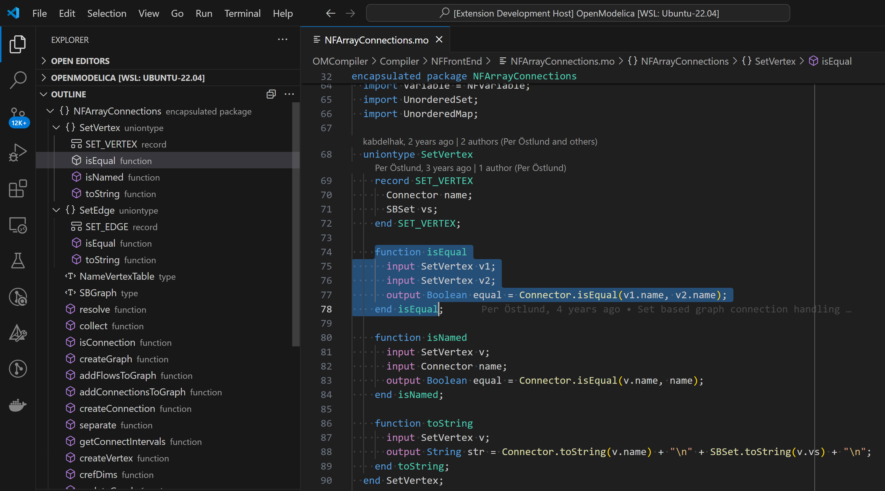
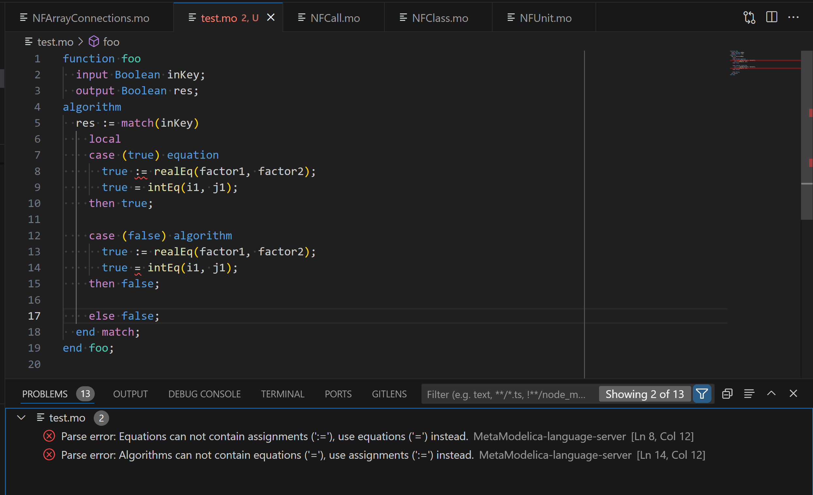

# MetaModelica Language Server

[](https://github.com/OpenModelica/metamodelica-language-server/actions/workflows/test.yml)

A very early version of a MetaModelica Language Server based on
[OpenModelica/tree-sitter-metamodelica](https://github.com/OpenModelica/tree-sitter-metamodelica).

For syntax highlighting install extension
[AnHeuermann.metamodelica](https://marketplace.visualstudio.com/items?itemName=AnHeuermann.metamodelica)
in addition.

## Functionality

This Language Server works for MetaModelica files. It has the following language
features:

- Provide Outline of MetaModelica files.

  

- Diagnostics:

  

## CLI (`mmlsc`)

The package ships a command-line tool, `mmlsc`, for batch-processing MetaModelica
source files without opening VS Code.

### Usage

```text
mmlsc [--fix] [--check <name>]... <paths...>
```

| Argument / option | Description |
| ----------------- | ----------- |
| `<paths...>` | Files or directories to process. Directories are scanned **recursively** for `.mo` files. |
| `--fix` | Apply quick-fixes **in-place** and save the modified files. Without this flag the tool only reports issues and exits with `1`. |
| `--check <name>` | Limit processing to a specific check (repeatable). When omitted all checks run. See [Supported quick-fixes](#supported-quick-fixes) for available names. |
| `--jobs N` | Process files in parallel using `N` worker threads (default: number of CPU cores; pass `1` to disable). |
| `--help` | Print usage information. |

### Example

Report all issues in a source tree:

```bash
mmlsc src/
```

Apply quick-fixes for all detected issues:

```bash
mmlsc --fix src/
```

Apply only the unused-variable fix:

```bash
mmlsc --fix --check unused-var src/
```

When installed globally (`npm install -g .` from the repository root after
building), the tool is available as `mmlsc`.

### Supported quick-fixes

| Check name | Diagnostic | Fix |
| --- | --- | --- |
| `unused-var` | Unused variable in a `protected` section or `local` block | Remove the variable declaration |
| `unused-match-arg` | Unused `match`/`matchcontinue` argument (pattern is `_` in every case) | Remove the argument from the input tuple and all case patterns |
| `unused-case-binding` | Unused binding in a `case` pattern — the bound identifier is never read in the case body | Replace the binding with `_` |
| `unused-silenced-output` | Unnecessary output silencing (`_ := expr`) — the `_ :=` prefix can be omitted | Remove the `_ :=` prefix, keeping only the expression |
| `wildcard-match` | Wildcard before `match`/`matchcontinue` (`_ := match …`) — `_` silently discards any return value; `()` is preferred because the compiler will error if a branch returns a non-unit value, catching accidental discards | Replace `_` with `()` |
| `dead-silenced-assign` | Dead assignment `_ := variable;` where the RHS is a plain variable (no side effect) | Drop the entire statement |
| `redundant-parens` | Single-element parentheses in a `match` input, `case` pattern, or assignment LHS | Unwrap the parentheses |
| `wildcard-tuple` | All-wildcard tuple pattern `(_, _, _)` nested inside a `case` pattern — every element is already a wildcard | Collapse to a single `_` |

## Installation

### Via Marketplace

- [Visual Studio Marketplace](https://marketplace.visualstudio.com/items?itemName=OpenModelica.metamodelica-language-server)
- [Open VSX Registry](https://open-vsx.org/extension/OpenModelica/metamodelica-language-server)

### Via VSIX File

Download the latest
[metamodelica-language-server-0.3.0.vsix](https://github.com/OpenModelica/metamodelica-language-server/releases/download/v0.3.0/metamodelica-language-server-0.3.0.vsix)
from the
[releases](https://github.com/OpenModelica/metamodelica-language-server/releases)
page.

Check the [VS Code documentation](https://code.visualstudio.com/docs/editor/extension-marketplace#_install-from-a-vsix)
on how to install a .vsix file.
Use the `Install from VSIX` command or run

```bash
code --install-extension metamodelica-language-server-0.3.0.vsix
```

## Contributing ❤️

Contributions are very welcome!

We made the first tiny step but need help to add more features and refine the
language server.

If you are searching for a good point to start
check the
[good first issue](https://github.com/OpenModelica/metamodelica-language-server/labels/good%20first%20issue).
To see where the development is heading to check the
[Projects section](https://github.com/OpenModelica/metamodelica-language-server/projects?query=is%3Aopen).
If you need more information start a discussion over at
[OpenModelica/OpenModelica](https://github.com/OpenModelica/OpenModelica).

Found a bug or having issues? Open a
[new issue](https://github.com/OpenModelica/metamodelica-language-server/issues/new/choose).

## Build

### Dependencies

- Node.js >= 22

### Quick install

```bash
npm install
npm run esbuild
```

### VS Code

- Open VS Code on this folder.
- Press ``Ctrl+Shift+B`` to start compiling the client and server.
- Switch to the Run and Debug View in the Sidebar (`Ctrl+Shift+D`).
- Select `Launch Client` from the drop down (if it is not already).
- Press ▷ to run the launch config (`F5`).
- Both build task and launch are available in [watch
  mode](https://code.visualstudio.com/docs/editor/tasks#:~:text=The%20first%20entry%20executes,the%20HelloWorld.js%20file.)
- In the [Extension Development
  Host](https://code.visualstudio.com/api/get-started/your-first-extension#:~:text=Then%2C%20inside%20the%20editor%2C%20press%20F5.%20This%20will%20compile%20and%20run%20the%20extension%20in%20a%20new%20Extension%20Development%20Host%20window.)
  instance of VSCode, open a document in `'metamodelica'` language mode.
  - Check the console output of `MetaModelica Language Server` to see the parsed
    tree of the opened file.

## Testing

The test suite runs inside a VS Code instance (via [`@vscode/test-electron`](https://github.com/microsoft/vscode-test)) and requires a display. It also exercises the GDB adapter, so `gdb` and `omc` must be on `PATH`.

### Prerequisites

- Node.js >= 22
- `gdb`
- `omc` (OpenModelica Compiler)
- A display server — on a headless machine use `xvfb`

### Running the tests

Build the extension first, then run the suite:

```bash
npm install
npm run esbuild
npm test
```

On a headless machine (e.g. WSL2 without WSLg, or a CI server) provide a
virtual display with `xvfb-run`:

```bash
sudo apt-get install -y xvfb gdb
xvfb-run -a npm test
```

This is equivalent to what the CI workflow does.

## Build and Install Extension

```bash
npx vsce package
```

## License

**metamodelica-language-server** is licensed under the OSMC Public License v1.8, see
[License.txt](./License.txt).

### 3rd Party Licenses

This extension is based on
[https://github.com/microsoft/vscode-extension-samples/tree/main/lsp-sample](https://github.com/microsoft/vscode-extension-samples/tree/main/lsp-sample),
licensed under MIT license.

Some parts of the source code are taken from
[bash-lsp/bash-language-server](https://github.com/bash-lsp/bash-language-server),
licensed under the MIT license and adapted to the MetaModelica language server.

The debugger is based on [microsoft/vscode-mock-debug](https://github.com/microsoft/vscode-mock-debug) licensed under MIT.

[OpenModelica/tree-sitter-metamodelica](https://github.com/OpenModelica/tree-sitter-metamodelica)
is included in this extension and is licensed under the [OSMC-PL
v1.8](./server/License.txt).

## Acknowledgments

This package was initially developed by
[Hochschule Bielefeld - University of Applied Sciences and Arts](hsbi.de).
