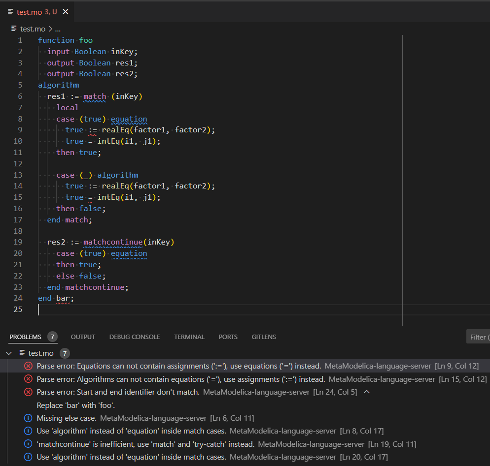

# MetaModelica Language Server

[](https://github.com/OpenModelica/metamodelica-language-server/actions/workflows/test.yml)

A very early version of a MetaModelica Language Server based on
[OpenModelica/tree-sitter-metamodelica](https://github.com/OpenModelica/tree-sitter-metamodelica).

For syntax highlighting install extension
[AnHeuermann.metamodelica](https://marketplace.visualstudio.com/items?itemName=AnHeuermann.metamodelica)
in addition.

## Functionality

This Language Server works for MetaModelica files. It has the following language
features:

  - Provide Outline of MetaModelica files.

    

  - Diagnostics:

    

## Installation

### Via Marketplace

`OpenModelica.metamodelica-language-server` is not yet listed on the marketplace.

### Via VSIX File

Download the latest
[metamodelica-language-server-0.2.0.vsix](https://github.com/OpenModelica/metamodelica-language-server/releases/download/v0.2.0/metamodelica-language-server-0.2.0.vsix)
from the
[releases](https://github.com/OpenModelica/metamodelica-language-server/releases)
page.

Check the [VS Code documentation](https://code.visualstudio.com/docs/editor/extension-marketplace#_install-from-a-vsix)
on how to install a .vsix file.
Use the `Install from VSIX` command or run

```bash
code --install-extension metamodelica-language-server-0.2.0.vsix
```

## Contributing ❤️

Contributions are very welcome!

We made the first tiny step but need help to add more features and refine the
language server.

If you are searching for a good point to start
check the
[good first issue](https://github.com/OpenModelica/metamodelica-language-server/labels/good%20first%20issue).
To see where the development is heading to check the
[Projects section](https://github.com/OpenModelica/metamodelica-language-server/projects?query=is%3Aopen).
If you need more information start a discussion over at
[OpenModelica/OpenModelica](https://github.com/OpenModelica/OpenModelica).

Found a bug or having issues? Open a
[new issue](https://github.com/OpenModelica/metamodelica-language-server/issues/new/choose).

## Structure

```
.
├── client // Language Client
│   ├── src
│   │   ├── test // End to End tests for Language Client / Server
│   │   └── extension.ts // Language Client entry point
├── package.json // The extension manifest.
└── server // MetaModelica Language Server
    └── src
        └── server.ts // Language Server entry point
```

## Building the Language Server

  - Run `npm install` and `npm run postinstall` in this folder.This installs all
    necessary npm modules in both the client and server folder
  - Open VS Code on this folder.
  - Press Ctrl+Shift+B to start compiling the client and server in [watch
    mode](https://code.visualstudio.com/docs/editor/tasks#:~:text=The%20first%20entry%20executes,the%20HelloWorld.js%20file.).
  - Switch to the Run and Debug View in the Sidebar (Ctrl+Shift+D).
  - Select `Launch Client` from the drop down (if it is not already).
  - Press ▷ to run the launch config (F5).
  - In the [Extension Development
    Host](https://code.visualstudio.com/api/get-started/your-first-extension#:~:text=Then%2C%20inside%20the%20editor%2C%20press%20F5.%20This%20will%20compile%20and%20run%20the%20extension%20in%20a%20new%20Extension%20Development%20Host%20window.)
    instance of VSCode, open a document in 'metamodelica' language mode.
    - Check the console output of `Language Server MetaModelica` to see the parsed
      tree of the opened file.

## Build and Install Extension

```
npx vsce package
```

## License

metamodelica-language-server is licensed under the OSMC Public License v1.8, see
[OSMC-License.txt](./OSMC-License.txt).

### 3rd Party Licenses

This extension is based on
[https://github.com/microsoft/vscode-extension-samples/tree/main/lsp-sample](https://github.com/microsoft/vscode-extension-samples/tree/main/lsp-sample),
licensed under MIT license.

Some parts of the source code are taken from
[bash-lsp/bash-language-server](https://github.com/bash-lsp/bash-language-server),
licensed under the MIT license and adapted to the MetaModelica language server.

[OpenModelica/tree-sitter-metamodelica](https://github.com/OpenModelica/tree-sitter-metamodelica)
v0.2.0 is included in this extension and is licensed under the [OSMC-PL
v1.8](./server/OSMC-License.txt).

## Acknowledgments

This package was initially developed by
[Hochschule Bielefeld - University of Applied Sciences and Arts](hsbi.de).
